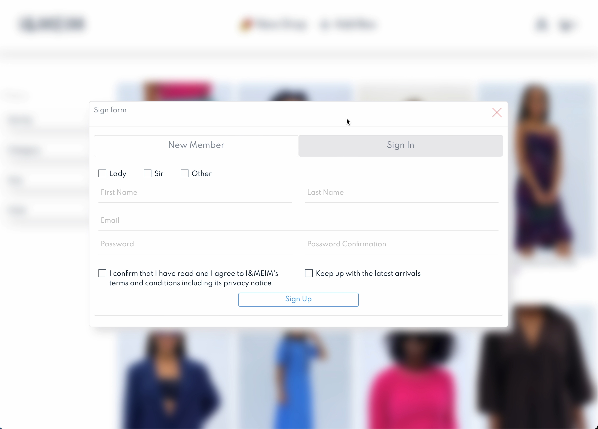
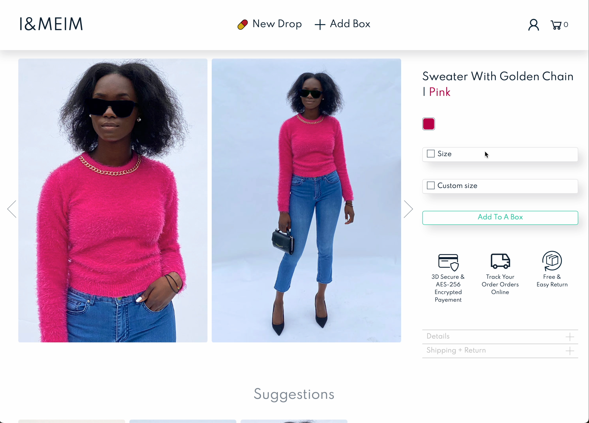
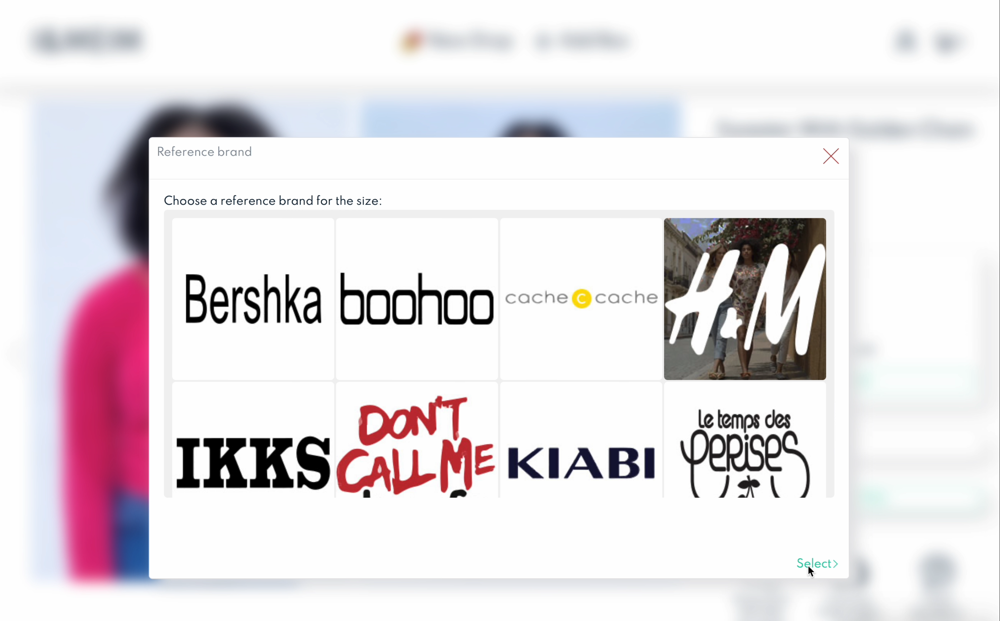
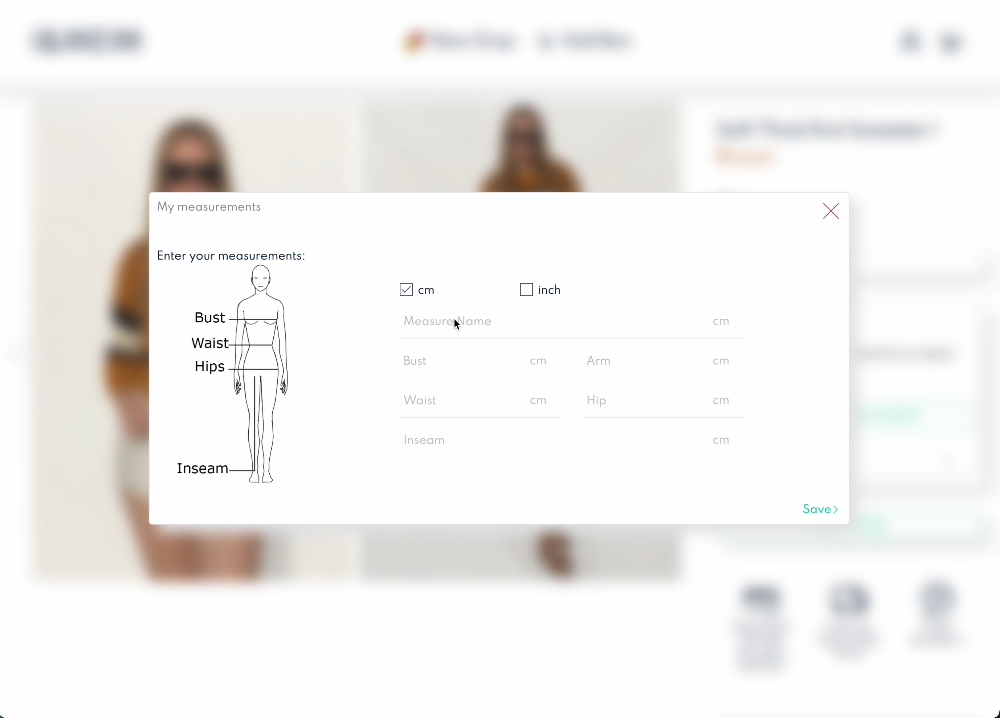
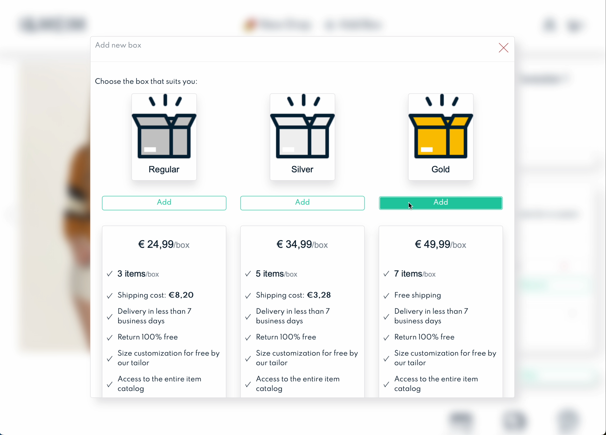
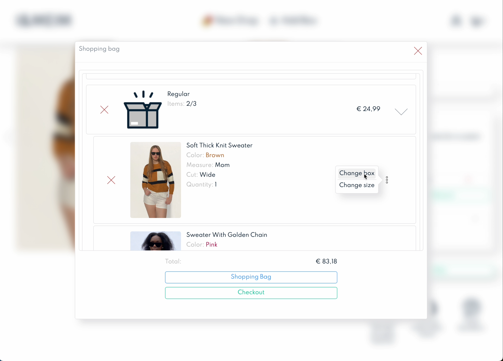
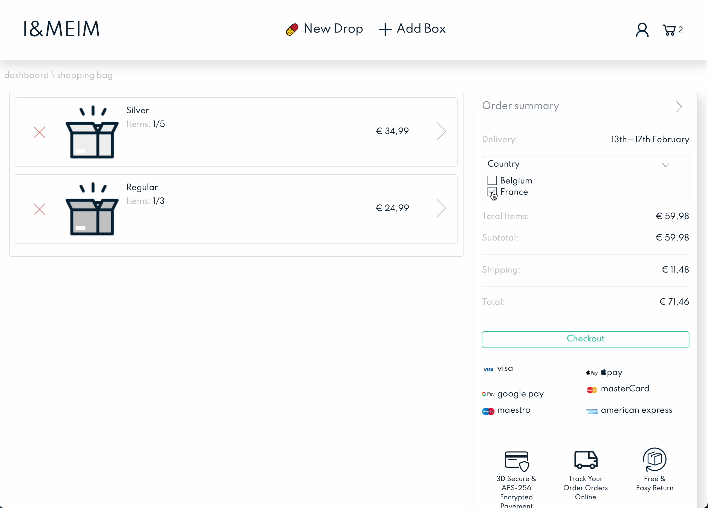

# E-shop
<!-- ❌ Don't Delete This Comment ❌
Project short description:
  Full-stack e-shop web application
Project Topics (tags):
  mysql css html jquery php javascipt
-->

This e-shop application proposes an interface that allows users to group products inside boxes and purchase the latter.
It features an interface that allows users to tailor-make their clothing products.

## Features

* Users sign in and sign up
* Product filter
* For clothing products:
  * Enter personal measurement
  * Select a size and a brand so the clothing will be resized following the brand's measurement for the selected size
  * Tutorial about how to use tailor-made features
* CRUD boxes
* CRUD product inside boxes
* Sends order confirmation email
* Support the change of country and currency
* Support multiple languages
* Support payments through Stripe's API
* Responsive design

See features in action on Youtube with *TimeCodes*: <https://youtu.be/jN8yElFXpwU?si=IZJf_XmNvHxxangz>

## Technologies

* Back-end:
  * PHP 7.4
  * MySQL
* Front-end:
  * HTML
  * CSS
  * JavaScript
  * JQuery

## Database schema

* Note: Tables in ${\color{red}red}$ are deprecated.

## Screenshots

<h3 style="text-align: center">Landing Page</h3>

  

<h3 style="text-align: center">Sign Form</h3>

  

<h3 style="text-align: center">Product Filter</h3>

  

<h3 style="text-align: center">Single Product</h3>

  

<h3 style="text-align: center">Select Brand Cut</h3>

  

<h3 style="text-align: center">Measurement Form</h3>

  

<h3 style="text-align: center">Boxes Prices</h3>

  

<h3 style="text-align: center">Basket</h3>

  

<h3 style="text-align: center">Basket Page</h3>

  

