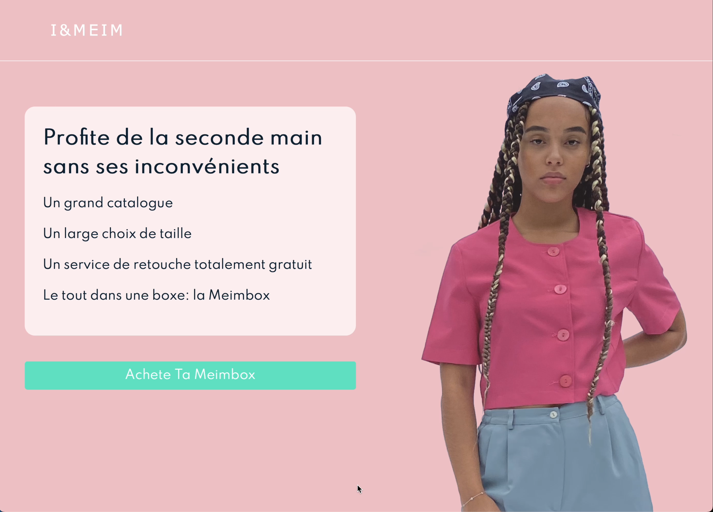

# E-shop

This e-shop application propose an interface that allow users to group product inside boxes and purchase the latter.
This application feature an interface that allow users to tailor made they clothe product.

## Features

* User sign in and sign up
* Product filter
* For clothe products:
  * Form to enter personal measurement
  * Form to tight standard size to cut from a user's favorite brand
  * Tutorial about how to use tailor made feature
* CRUD boxes
* CRUD product inside boxes
* Sends order confirmation email
* Support change of country and currency
* Support multiple language
* Support payments through Stripe's API
* Responsible design

See features in action on Youtube with *TimeCodes*: <https://youtu.be/jN8yElFXpwU?si=IZJf_XmNvHxxangz>

## Technologies

* Back-end:
  * PHP 7.4
  * MySQL
* Front-end:
  * HTML
  * CSS
  * JavaScript
  * JQuery

## Database schema

* Note: Tables in ${\color{red}red}$ are deprecated

## Screenshots

<h3 style="text-align: center">Landing Page</h3>

  

<h3 style="text-align: center">Sign Form</h3>

  

<h3 style="text-align: center">Product Filter</h3>

  

<h3 style="text-align: center">Single Product</h3>

  

<h3 style="text-align: center">Select Brand Cut</h3>

  

<h3 style="text-align: center">Measurement Form</h3>

  

<h3 style="text-align: center">Boxes Prices</h3>

  

<h3 style="text-align: center">Basket</h3>

  

<h3 style="text-align: center">Basket Page</h3>

  

